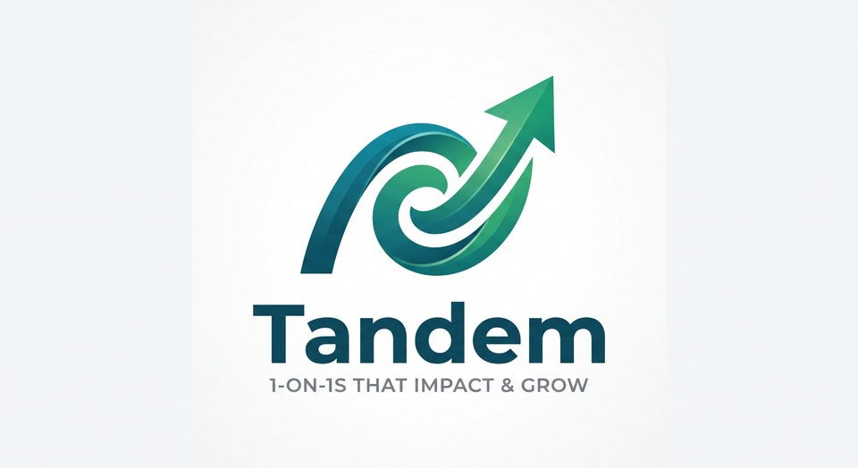

# Tandem

  

**Free, open-source 1-on-1 coaching for leaders at every level, in every kind of organization.**

Tandem gives two people a focused place to prepare, meet, capture commitments, and track growth over time. It is organization-neutral, MIT-licensed, and designed to feel as polished as paid leadership software.

- [Try the no-sign-in demo](https://lead-together-now.lovable.app/demo)
- [Read the user guide](./USER_GUIDE.md)
- [Self-host Tandem](./SELF_HOSTING.md)
- [Brand it for your organization](./BRANDING.md)

## What Tandem includes

- Workspaces with owner, admin, and member roles
- Reporting, skip-level, coaching, and mentoring relationships
- Shared agendas that both participants can build
- Separate question sets for the leader and the other participant
- Shared notes plus private notes for each person
- Action items with owners, due dates, and carry-over between meetings
- A growth timeline with Markdown export
- Transfer of a 1-on-1 and its history to a new leader
- Optional AI summaries and action-item suggestions
- Workspace-level name, logo, accent color, welcome message, and help contact
- Installable phone and tablet experience through the browser

## Coaching question library

Every new workspace starts with nine published templates and 90 prompts: five for the leader and five for the other participant in each template.

1. Weekly check-in
2. Coaching check-in
3. Career growth
4. Quarterly goals review
5. First 90 days
6. Skip-level
7. Project debrief
8. Back from time away
9. Getting back on track

Admins can edit, copy, publish, unpublish, or create templates. A meeting copies its prompts when it begins, so later template edits never alter past meetings.

## Try it without an account

The public demo is a complete sample coaching check-in. Visitors can edit the agenda and notes, complete action items, and view a sample AI summary. Demo changes stay only in the current browser session and are not saved.

## Privacy by design

- Only the two participants can edit their meeting.
- Private notes are available to both people and readable only by their author.
- Private notes are never sent to AI.
- A skip-level leader may read shared content, but never private notes.
- Workspace admins can manage members, relationships, templates, and branding without gaining access to meeting notes.
- Database row-level security enforces these rules independently of the interface.

AI is optional and can be disabled for an entire workspace. All core meeting features work without it.

## Install on a phone or tablet

Tandem is an installable progressive web app. It opens in a standalone window and adapts to phones and tablets.

- **iPhone or iPad:** open Tandem in Safari, tap **Share**, then **Add to Home Screen**.
- **Android:** open Tandem in Chrome, open the browser menu, then choose **Install app** or **Add to Home screen**.

Tandem currently requires an internet connection and does not cache meeting notes for offline use.

## Invitations

An admin adds an email address in Settings and copies the invitation link for that person. The link opens sign-up with their address pre-filled, and they join the workspace automatically on first sign-in.

## Calendar

Every 1-on-1 and every relationship offers **Add to calendar** — Google Calendar, Outlook, and a standard calendar file for Apple Calendar and other apps — with an optional recurring series matching the relationship's chosen rhythm.

## Technology

Tandem uses TanStack Start, React, Tailwind CSS, PostgreSQL-compatible storage with row-level security, and the Vercel AI SDK. It can be deployed to a Workers-compatible host and connected to a hosted or self-managed Supabase-compatible backend.

## Documentation

- [User guide](./USER_GUIDE.md)
- [Self-hosting guide](./SELF_HOSTING.md)
- [Branding guide](./BRANDING.md)
- [Contributing guide](./CONTRIBUTING.md)
- [Project repository](https://github.com/mckinneylibrary/leadershiptandem)

## License

Tandem is released under the [MIT License](./LICENSE). You may use, modify, brand, host, and redistribute it under the terms of that license.